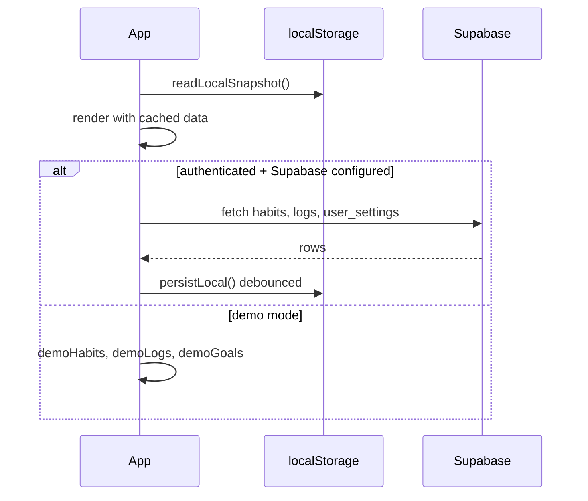

# Zen — App Logic

**Last updated:** June 2026  
**Companion:** [APP-DESCRIPTION.md](./APP-DESCRIPTION.md) (product + phase status)

This document describes how the app works: architecture, domain rules, persistence, and UI data flow.

---

## Architecture overview

```mermaid
flowchart TB
  subgraph ui [apps/web]
    Routes[routes/*.tsx]
    Components[components/**]
    Hooks[hooks/useData + feature hooks]
    Lib[lib/* helpers]
  end

  subgraph core [@mottazen/core]
    Scoring[scoring.ts]
    Categories[categories.ts]
    Goals[goals.ts]
    Streaks[streaks.ts]
    Insights[insights.ts]
    Notifications[notifications.ts]
  end

  subgraph persist [Persistence]
    LS[(localStorage snapshot)]
    SB[(Supabase Postgres)]
  end

  Routes --> Components --> Hooks
  Hooks --> core
  Hooks --> LS
  Hooks --> SB
  Lib --> Hooks
```

**Rule:** All score/progress/streak/notification *decisions* live in `@mottazen/core`. React components format and interact; they do not reimplement math.

---

## Repository layout

```
zen/
├── apps/web/                 # Vite + React UI
│   └── src/
│       ├── app/              # router.tsx, providers.tsx
│       ├── routes/           # Page screens
│       ├── components/       # UI by feature area
│       ├── hooks/            # React state + side effects
│       ├── lib/              # IO, theme, haptics, export, push
│       └── styles/           # tokens.css, app.css, glass.css
├── packages/core/            # @mottazen/core (Vitest)
├── supabase/
│   ├── migrations/           # Postgres schema + RLS
│   └── functions/            # send-reminders, send-test-push
└── docs/rebuild/             # Phase 1–4 specifications
```

---

## Routing

| Path | Screen | Notes |
|------|--------|-------|
| `/` | Redirect → `/log` | |
| `/auth` | Sign in / sign up | Email + Google |
| `/log`, `/log/:date` | Today | `useSyncLogDateRoute` binds URL ↔ date |
| `/habit/:id` | Habit detail | Charts, calendar, history |
| `/categories` | Category index | Sparklines, compare |
| `/categories/:slug` | Category detail | Weights, goals, breakdown |
| `/insights` | Insights hub | Reorderable cards, heatmap |
| `/insights/heatmap` | Redirect → `/insights` | |
| `/goals` | Goals list | CRUD via modals + cards |
| `/goals/new` | Add goal | Opens create modal |
| `/goals/:id` | Goal detail | Full progress + linked activities |
| `/profile` | Settings hub | |
| `/profile/notifications` | Coach settings | |
| `/profile/data` | Export / import | |
| `/profile/theme` | Accent, tints, glass | |
| `/profile/goals`, `/profile/display` | Redirects | Deprecated paths |

**Navigation:** 5 primary tabs — Today, Insights, Goals, Categories, You (`lib/nav-tabs.ts`). Phase 1 spec had 4 tabs; Categories was promoted.

---

## Domain model (`@mottazen/core`)

### Habit

```typescript
type HabitType = "check" | "numeric" | "milestone" | "onetime";
```

| Type | Log semantics | Score |
|------|---------------|-------|
| `check`, `onetime` | value > 0 = done | 0 or 100 |
| `numeric`, `milestone` | value between min..max | linear 0–100 |

Fields: `category`, `min`, `max`, `step`, `paused`, `orderIndex`, `color`, `remindAt`, `notify`, `why`.

### Day log

```typescript
interface DayLog {
  habitId: string;
  date: string;       // YYYY-MM-DD local
  value: number | null;
  isRest?: boolean;
}
```

| State | Storage | Scoring |
|-------|---------|---------|
| Not logged | no row / `value: null` | Excluded from day & category averages |
| Rest / skip day | `value: -1` or `isRest: true` | Excluded from aggregates |
| Skipped (explicit 0) | `value: 0` | Contributes **0** to averages |
| Progress | value > 0 | Scored per habit type |

### Goal

```typescript
type GoalKind = "consistency" | "cumulative" | "legacy";
```

| Kind | Progress meaning |
|------|------------------|
| `consistency` | % of calendar weeks (Mon–Sun) where linked habits meet `daysPerWeek` |
| `cumulative` | Units logged toward `targetTotal` in date range |
| `legacy` | Weighted blend of daily/weekly habit scores vs `targetPercent` |

`GoalHabitLink`: `{ goalId, habitId, weight, required }`.

Goals also have optional `category`, `color`, `startDate`, `endDate`.

**Postgres:** `0006_goals_v2.sql` aligns the `goals` table with the app model. Legacy `period` / `target_percent` remain for `kind = 'legacy'`.

---

## Scoring rules

### Per-habit score (`habitScore`)

1. Rest → `null` (excluded)
2. Not logged → `null` (excluded)
3. Check/onetime → 100 if value > 0, else 0
4. Numeric/milestone → `round(clamp((v - min) / (max - min), 0, 1) * 100)`

### Day score (`dayScore`)

Average of **non-null** habit scores for **active** (non-paused) habits on that date.  
If no scorable habits → `0`.

### Category score (`categoryScore`)

Weighted average of habit scores in a category using `CategoryWeights` (per-habit weights within the category). Respects rest/not-logged exclusion.

### Hero copy (`heroCopy`)

| Day score | Status | Suggestion |
|-----------|--------|------------|
| 100 | Perfect day. | You showed up everywhere. |
| ≥ 80 | Strong day. | Keep the streak alive. |
| ≥ 50 | Solid momentum. | A few quick logs can turn this into a strong day. |
| > 0 | Building momentum. | Log the next small action. |
| 0 | Clean start. | Log the small actions—the system handles the analysis. |

### Streaks (`streaks.ts`)

- Check/onetime: day counts if value > 0
- Numeric: day counts if value meets target (per type rules)
- Rest days **preserve** streak (do not break)

---

## Goals progress (`goals.ts`)

- `goalProgress(goal, links, habits, logs, date)` → 0–100 for the evaluation date
- `goalsForHabit` / `goalsForCategory` — filter active goals for UI
- `goalHeaderMeta` — title line + % for cards and category sections
- Consistency goals evaluate week buckets; cumulative sum log values in range

---

## Insights (`insights.ts`)

- Radar chart axes from category scores
- Heatmap maps day scores to intensity levels
- Period helpers: today, week, month, year, all
- `bestHabitByConsistency`, metric bars — all derived from core logs + habits

---

## Notifications (`notifications.ts` + web scheduler)

### Settings shape (`NotificationSettings`)

Master `enabled`, `quietHours`, `maxPerDay`, `tone`, `vacationMode`, plus toggles: daily check-in, smart missed, motivation, recovery, low score, reflection, `categoryRules[]`.

### Runtime

1. **`useNotificationScheduler`** — every 60s while app open, calls `checkNotificationReminders` with current habits/logs/settings/timezone
2. **`coachNotify`** — wraps browser `Notification` API; dedupes via `notify-log` tags
3. **On log** — `checkMotivationOnLog` may fire immediate coach message when logging today
4. **Web Push** — `push-subscribe.ts` + service worker + Edge Functions for background (Phase 4 ops)

---

## Haptics (`lib/haptic.ts`)

| Event | Android / desktop | iOS |
|-------|-------------------|-----|
| Forward progress step | `navigator.vibrate(14)` | Native Taptic via real `<input switch>` on checkbox / +/- tap |
| Milestone (day 100%, goal 100%, activity target met) | Triple pulse `[32,100,48,100,64,100,88]` | No-op (programmatic haptics blocked) |

**Settings** (`lib/haptic-settings.ts` + `useHapticSettings`):

- `enabled`, `progressSteps`, `completion` — stored in `localStorage` key `mottazen-haptic`
- `haptic.ts` reads settings on each call; iOS switch attribute via `asHapticSwitch`

**Trigger site:** `useData.setLogValue` — only on forward progress (not decrease/rest). Detects:

1. Day score crosses to ≥ 100
2. Any linked goal crosses to ≥ 100
3. Habit `habitScore` crosses to ≥ 100

---

## Themes & display

| Concern | Storage | Hook |
|---------|---------|------|
| Light / dark / system | `localStorage` | `useTheme` |
| Accent, background tints, glass opacity | `localStorage` | `useTheme` + `ProfileThemePage` |
| Display density (normal / compact / activity-only) | `localStorage` | `useDisplayPrefs` |
| Show edit buttons on cards | `localStorage` | `useDisplayPrefs` |
| Category pastel tints | `user_settings.category_colors` + snapshot | `useData` |

CSS tokens in `styles/tokens.css`; layout in `app.css`; glass surfaces in `glass.css`.

---

## Data layer (`useData.tsx`)

Central React context: habits, logs, goals, goalHabits, categoryWeights, categoryColors, dailyNotes, dayMood, notificationSettings, timezone.

### Boot sequence



### Write path (`setLogValue` example)

1. Resolve new value from function or literal
2. If forward progress → haptic (milestone vs bump)
3. Optimistic `setLogs`
4. Debounced `persistLocal()` → localStorage snapshot
5. If authed → `supabase.from("habit_logs").upsert/delete`
6. If today → optional coach notification via `checkMotivationOnLog`

Same pattern for habits CRUD (immediate local + Supabase upsert). Goals mutations update React state + local snapshot **only** — no Supabase calls.

### What syncs to Supabase

| Entity | Cloud table | Notes |
|--------|-------------|-------|
| Habits | `habits` | Includes type, notify jsonb, meta.why |
| Logs | `habit_logs` | `is_rest`, value -1 for rest |
| Settings | `user_settings` | daily_notes (notes + mood blob), category_weights, category_colors, notification_prefs, timezone |
| Goals | `goals` | kind, dates, cumulative fields, color |
| Goal links | `goal_habits` | weight, required; cascade delete |

### localStorage snapshot (`mottazen-data-snapshot`)

Full offline cache: habits, logs, goals, goalHabits, weights, colors, notes, mood, notification settings, timezone, `savedAt`.

### Export / import (`lib/export-import.ts`)

`ExportBundle` includes goals + goalHabits. Import replaces in-memory state and persists snapshot. Legacy converter maps old export format.

---

## Auth (`useSession.tsx`)

- Supabase Auth: email/password, Google OAuth
- On sign-in → `useData.loadCloud()` refetches habits, logs, settings, **goals**, goal_habits
- Pull-to-refresh on Today calls `reloadFromCloud()` (same fetch)

---

## Key UI flows

### Today logging

```
User taps checkbox / + / numeric input
  → HabitCard / setLogValue
  → core: habitScore, dayScore, goalProgress (for haptics)
  → hapticProgressBump | hapticGoalComplete
  → state update → persistLocal → Supabase upsert
  → HeroScore re-renders (animated ring, confetti if 100%)
```

### Hero score celebration

`HeroScore` tracks previous score per date. When score increases:

- Brief celebrate CSS class on card
- If crossing 100%: `celebrateConfetti` on ring element
- `ScoreRing`: gold stroke when value ≥ 100; animation disables CSS transition so ring and number stay in sync

### Habit card states

| CSS / logic | Condition |
|-------------|-----------|
| `habit-card--skipped` | logged 0, not rest |
| `habit-card__name--progress` | partial numeric or check done |
| `habit-card__name--skipped` | strikethrough name |

### Category drill-down

Today chips filter list locally **or** navigate to `/categories/:slug` for full analysis.

---

## Service worker & PWA

- `main.tsx` registers `/sw.js` in production
- `manifest.json` — standalone, start `/log` (name currently **Zen** — see APP-DESCRIPTION branding note)
- Push handler in SW (when VAPID configured)

---

## Testing

`npm run test` → Vitest on `packages/core`:

- `scoring.test.ts`
- `goals.test.ts`
- `insights.test.ts`
- `notifications.test.ts`
- `streaks.test.ts`

UI is not unit-tested; manual smoke tests in `docs/rebuild/SMOKE-TESTS.md`.

---

## Environment variables

| Variable | Purpose |
|----------|---------|
| `VITE_SUPABASE_URL` | Supabase project |
| `VITE_SUPABASE_ANON_KEY` | Client auth + RLS queries |
| `VITE_VAPID_PUBLIC_KEY` | Web Push subscription (optional) |

Missing Supabase vars → **demo mode** (`lib/demo-data.ts`).

---

## Recommended next engineering work

1. **Phase 4 ops** — [`PHASE-4-OPS.md`](./PHASE-4-OPS.md): VAPID, cron, smoke tests S1–S15
2. **Optional:** IndexedDB for larger offline cache
3. **Manual:** Lighthouse PWA audit, 3-day dogfood sign-off (Phase 3 AC1)

---

## File index (logic-critical)

| Area | Path |
|------|------|
| Domain exports | `packages/core/src/index.ts` |
| Scoring | `packages/core/src/scoring.ts` |
| Goals math | `packages/core/src/goals.ts` |
| Data store | `apps/web/src/hooks/useData.tsx` |
| Local cache | `apps/web/src/lib/local-data-store.ts` |
| Haptics | `apps/web/src/lib/haptic.ts` |
| Router | `apps/web/src/app/router.tsx` |
| DB schema | `supabase/migrations/0001_base.sql` + patches |
| Phase specs | `docs/rebuild/PHASE-*.md` |
