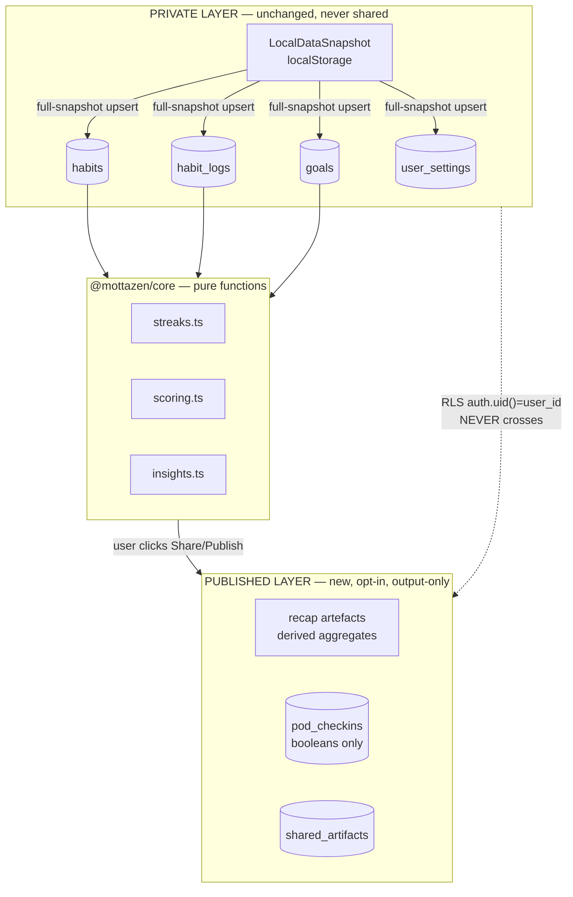

# Viral Plan for future implementation

> **Status:** Planning — not yet implemented  
> **Principle:** Share the output, not the content. Your goals are nobody's business.

---

## Architectural context

Zen today is **local-first and owner-only**. Everything lives in a `LocalDataSnapshot` (`local-data-store.ts`), pushed to Supabase as a full upsert (`cloud-sync.ts`), and every RLS policy is `auth.uid() = user_id` (`0002_rls.sql`). Nothing is shareable today. Domain logic (`streaks.ts`, `scoring.ts`, `insights.ts`, `goals.ts`) is pure functions in `@mottazen/core`.

That's not a limitation — it's the moat. The cleanest way to fit viral and social features in is to **never touch the private snapshot**, and treat all social/sharing as a separate **published layer** that the user opts into deliberately. This is the "share the output, not the content" thesis, expressed as architecture.

---

## The spine: two layers, one hard boundary



**Rule of thumb:** private data is computed into a derived artefact, and only the artefact crosses the boundary. Raw `habit_logs` never leave owner-only RLS.

---

## Feature map: effort and privacy fit

| Feature | Layer | Lift | Privacy fit | Touches |
|---|---|---|---|---|
| **Comeback celebration** | Core + local | ~1 day | ✅ Perfect | `streaks.ts`, `StreakFlame.tsx`, `confetti.ts` |
| **Milestone share cards** | Output-only | 2–3 days | ✅ Perfect | `streaks.ts` tiers, new `ShareCard`, image export |
| **Year/Month "Wrapped"** | Output-only | 4–6 days | ✅ Perfect | new `recap.ts` in core, new route, lottie |
| **Streak gardens** | Output-only | 4–7 days | ✅ Perfect | new `StreakGarden`, render from streak data |
| **Identity mode** | Core + local | 3–5 days | ✅ Stays private | `types.ts`, snapshot, Today/Dashboard reframe |
| **Anonymous pods** | New backend | 1.5–2.5 wk | ✅ On-brand | new tables + RLS + edge fn matchmaking |
| **Invited co-check-ins** | New backend | 2–3 wk | ⚠️ Opt-in only | breaks owner-only; needs share/membership model |

The top five are **local or output-only** — they ship without weakening the privacy story. The bottom two need real backend work and are where to be most careful.

---

## Phase 1 — Privacy-safe, high-virality (no schema risk)

These compute from data already in the app and only emit an image the user chooses to post.

### 1. Comeback design (smallest, highest emotional ROI)

`streaks.ts` already has `currentStreak`, `longestStreak`, and tier helpers (`streakEmojiTier`). Add a pure detector:

```ts
// packages/core/src/streaks.ts
export function detectComeback(logs: DayLog[], habitId: string): {
  isComeback: boolean;
  gapDays: number;
  priorBest: number;
} {
  /* new streak started after a gap >= 2 days */
}
```

Then in `HabitCard.tsx`, when today's check-in **starts a new streak after a break**, fire `StreakFlame` + `confetti.ts` with a distinct "welcome back" emoji (🌱) and warm copy — never "you lost your streak." One-day change; emotionally intelligent and shareable.

### 2. Milestone share cards

Gate celebrations on existing streak tiers. When a tier fires (10 / 30 / 100 days), surface a **Share** action that renders a `ShareCard` to PNG. The card shows *discipline, not diary*: "100 days of showing up" + abstract visual — **no habit name unless the user toggles it on**. Use existing lottie + canvas / `html-to-image` export. Nothing hits the network.

### 3. Year/Month in Habits (Wrapped)

Add an aggregator to core so it's testable and reusable:

```ts
// packages/core/src/recap.ts (new)
export function buildRecap(
  habits: Habit[],
  logs: DayLog[],
  range: { from: string; to: string },
) {
  // total check-ins, "showed up N days", best streak, biggest comeback,
  // most consistent category, busiest weekday — all anonymizable aggregates
}
```

New route (`router.tsx`): `/recap/:period`. Animated with lottie (already a dep) + `confetti.ts`. Each slide is screenshot-ready. The shareable frame says **"I showed up 247 days"** — the number, never the list. Motion-graphics skill as growth lever, zero data exposure.

### 4. Streak gardens

Pure visual function of streak length / consistency → growth stage. Render SVG/lottie from `currentStreak` / `longestStreak` per habit or per category. Add as a Dashboard card and a full `/garden` view that exports an image. "100-day forest" screenshots = organic sharing, still output-only.

### 5. Identity mode

Strongest *positioning* differentiator; stays fully private. Add a first-class concept to core:

```ts
// packages/core/src/types.ts
export interface Identity {
  id: string;
  label: string; // "a runner", "a calm person"
  color?: string;
  habitIds: string[];
}
```

Then:

- Add `identities: Identity[]` to `LocalDataSnapshot` and snapshot sync (`cloud-sync.ts` + a new owner-only `identities` table — same RLS pattern as `goals`).
- Reframe Today/Dashboard to optionally group by identity and phrase progress as *"You showed up as a runner 4/5 days."*
- Keep it a **mode toggle** so existing habit-first users are not disrupted.

**Phase 1 does not change RLS or the sync contract.**

---

## Phase 2 — Anonymous pods (the right social)

The only social mechanic that fits an **anonymous-by-default** thesis. Deliberately **content-free** — members exchange *presence*, not data. New tables, isolated from the private snapshot:

```sql
-- new migration, e.g. 0009_pods.sql
create table pods (
  id uuid primary key,
  goal_tag text,
  size int,
  created_at timestamptz
);

create table pod_members (
  pod_id uuid references pods,
  user_id uuid references auth.users,
  anon_handle text, -- "Quiet Fox" — never the real identity
  primary key (pod_id, user_id)
);

create table pod_checkins (
  pod_id uuid,
  user_id uuid,
  day date,
  did_checkin boolean, -- a BOOLEAN: no habit name, no value, no note
  primary key (pod_id, user_id, day)
);
```

**RLS:** a member reads `pod_checkins` only for pods they belong to. The join to real identity is never exposed — clients only see `anon_handle` + the boolean.

**Matchmaking:** group 4–5 strangers by `goal_tag` via a Supabase edge function (same pattern as `send-reminders` for push). Live reactions/quotes via Supabase Realtime on `pod_checkins`.

**Why it fits:** behavioral benefit of being seen, zero exposure. Pods never pollute the local-first export/import bundle — they live in their own tables, queried directly, not through `pushSnapshotToCloud`.

---

## Phase 3 — Invited co-check-ins (only if demand is real)

The one feature that genuinely breaks the owner-only model. Treat as **strictly opt-in**. Do **not** route through `habit_logs` (that would entangle shared writes with private snapshot sync). Use a parallel **challenges** model:

```sql
create table shared_challenges (
  id uuid primary key,
  owner_id uuid,
  title text,
  scope text -- habit | goal | category projection
);

create table challenge_members (
  challenge_id uuid,
  user_id uuid,
  can_checkin bool,
  status text -- invited | accepted
);

create table challenge_checkins (
  challenge_id uuid,
  user_id uuid,
  day date,
  value numeric null
);
```

**RLS:** members read the challenge + each other's `challenge_checkins`. Owner's private `habit_logs` stay untouched and owner-only. A nightly or realtime projection copies only the agreed metric into `challenge_checkins`.

**Heaviest lift:** invitations, conflict handling, real-time, moderation surface for motivational quotes. Ship last.

---

## Recommended implementation order

1. **Phase 1** — in order: comeback → milestone card → recap → garden → identity. All privacy-safe, lean on `@mottazen/core` + lottie + confetti. Each is independently shippable and screenshot-driven.
2. **Phase 2** — anonymous pods. The only social that matches the brand.
3. **Phase 3** — co-check-ins, opt-in only, as a separate challenges model — never by loosening core RLS.

### Design invariants (non-negotiable)

- **The private snapshot never gains social fields.** Sharing always = compute a derived artefact, publish *that*.
- **Default to output-only.** Image export before any server feed.

---

## Suggested first build (when ready)

| Option | Scope | Why start here |
|---|---|---|
| **A** | Comeback detector + milestone `ShareCard` | Fastest wins; fully local; no schema |
| **B** | `recap.ts` aggregator + `/recap` route | Highest viral upside (Wrapped-style) |
| **C** | Phase 2 pods migration + RLS | Prove anonymous-social path early |

Option **A** is the lowest-risk starting point. Option **B** is the highest growth lever once core celebration UX is in place.
